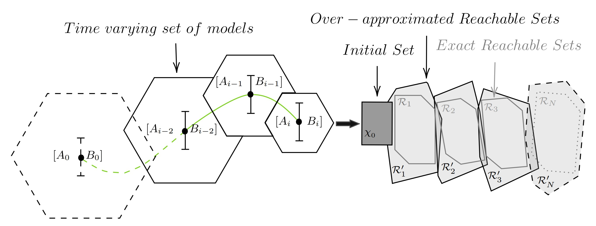

## Online Data-Driven Reachability Analysis using Zonotopic Recursive Least Squares
<br/> 
This repo contains the code for the following paper :
1- Naderi Akhormeh, Alireza and Hegazy, Amr and Alanwar, Amr. "Online Data-Driven Reachability Analysis using Zonotopic Recursive Least Squares".

## A Short video about the idea
 

## Problem Statement
We present a data-driven reachability analysis framework that computes over-approximations of reachable sets directly from online state measurements. The method estimates time-varying unknown models using an Exponentially Forgetting Zonotopic Recursive Least Squares (EF-ZRLS) method, which processes data corrupted by bounded noise. Specifically, a time-varying set of models that contains the true model of the system is estimated recursively, and then used to compute the forward reachable sets under process noise and uncertain inputs.<br />
The following figure summarizes the idea behind our papers.
<br /> <br />
<p align="center">

</p>

## Files Description 
This reposetory contaies the simulation have done in the paper.<br />


## Running 
1- Download [CORA 2025](https://tumcps.github.io/CORA//pages/archive/v2025/index.html).<br />
2- Add CORA and subfolders to the Matlab path.  <br />
3- Add the repo folder and subfolders to the Matlab path.  <br />
<br />
<br />
## Basix reachablity under the folder examples-basic:<br />
1- run Example1_A1.m and Example1_A2.m for the example 1.1 in the paper (Rechability Analysis of the LTI systems).<br />
2- run Example1_B.m for yhe example 1.2 in the paper (Rechability Analysis of the LTV systems).<br />
3- run Example2.m for the example 2 in the paper (Rechability Analysis of the Lipschitz Nonlinear Systems systems).<br />
<br />
<br />
Our papers Bibtex are as follow:<br />
```
@article{naderi2025online,
  title     = {Online Data-Driven Reachability Analysis using Zonotopic Recursive Least Squares},
  author    = {Naderi Akhormeh, Alireza and Hegazy, Amr and Alanwar, Amr},
  journal   = {To be filled},
  year      = {2025},
  volume    = {},
  number    = {},
  pages     = {},
  publisher = {}
}

```
